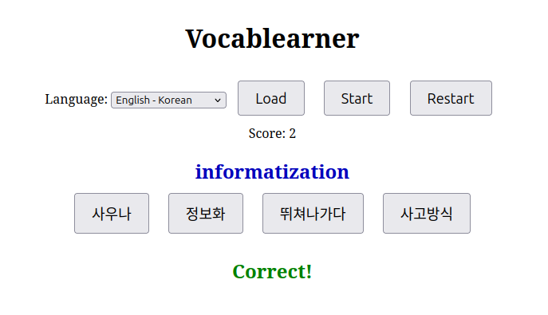
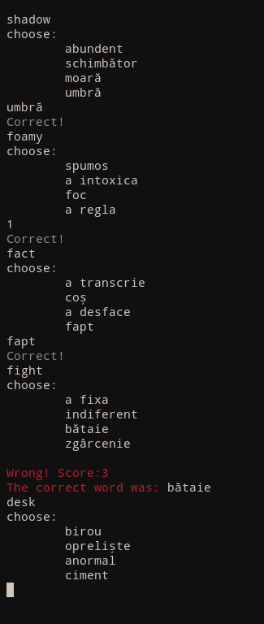

# vocablearner

## PROTOTYPE VERSION -- EXPECT FUTURE CHANGES

__vocablearner__ is a simple program that offers a quick way to refresh one's vocabulary in a selection
of languages. This program is available as a CLI utility, as well as a web version with a few more
features.

This tool is not meant to _teach_ you a language, just to aid in vocabulary building and retention.

# Gameplay example

### Web version

### Terminal version

# License
Source-code is licensed under the GNU GPLv3. See [LICENSE](./LICENSE) for details.

# Dictionaries

* The English-German dictionary was interpreted from the Project Gutenberg
  book ["Mr. Honey's Dictionary"](https://www.gutenberg.org/ebooks/3212).

* The English-Greek dictionary was manually interpreted from the
  [FreeDict](https://freedict.org/) database.

* The Hungarian and Romanian dictionaries were manually interpreted from a custom spellcheck library.

* The Korean dictionary features common TOPIK I and TOPIK II vocabulary.
