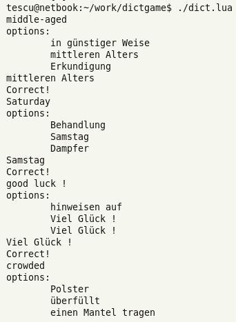

# dictgame

# THIS PROJECT IS WIP.

`dictgame` is a simple terminal program written in Lua that gives the user
a random word in a chosen language, and four possible translations.
The goal is to select the correct translation of the word. 3 mistakes result in
losing the game.

More game modes are planned.

# Gameplay example

Prototype screenshot:

# Dictionaries

* The English-German dictionary was interpreted from the Project Gutenberg
  book ["Mr. Honey's Dictionary"](https://www.gutenberg.org/ebooks/3212).

* The English-Greek dictionary was manually interpreted from the
  [FreeDict](https://freedict.org/) database.
